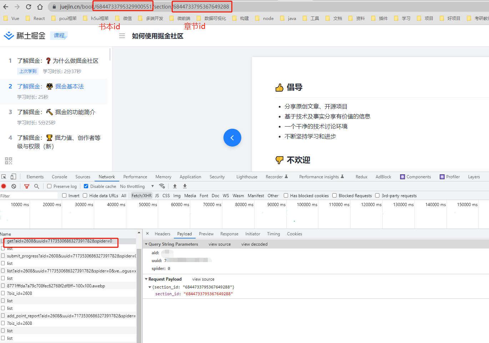
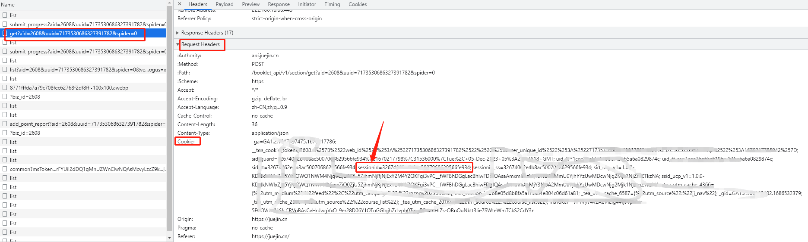
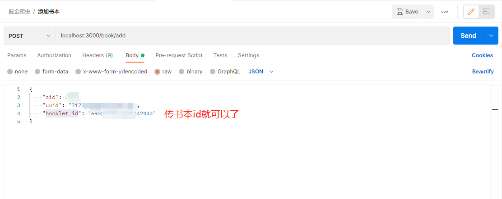
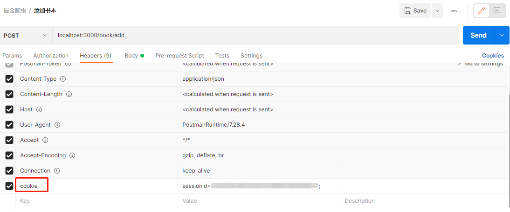

## 掘金爬虫 掘金小册爬虫 2023 年最新版本

注意 只能爬取免费的或者自己购买的小册。并不能获取没购买的小册。

## 技术

koa2 + mongodb

本项目并没有使用常规的爬取网页的方式爬取，而是通过接口获取数据，相对来说更简单实用。通过接口的方式能获取到 md 文本和 heml 文本，这两种数据都会进行存储，方便自己后续扩展。

## 项目抓取流程

1. 调用掘金文章接口，获取文章详情、文章章节列表，保存到自己的 mongodb 数据库。
2. 通过掘金章节详情接口，一次次请求获取章节信息，保存到自己的 mongodb 数据库。

## 怎么使用

### 安装包

运行 `npm install` 安装包

### 启动服务

运行 `npm run dev` 启动服务

### 调用接口抓取并存储文章数据

通过 postman 调用接口 `localhost:3000/book/add` 执行抓取逻辑。

下面重点分析下接口参数:

1. aid
2. uuid
3. booklet_id
4. cookie

我们随便打开一本小册，找到获取章节信息的接口 `https://api.juejin.cn/booklet_api/v1/section/get` 就能获取到前面三个参数了。

如图所示：

后面还需要一个 sessionid 参数，我们还是通过获取章节信息的接口 `https://api.juejin.cn/booklet_api/v1/section/get` 接口

在请求体里面找到 cookie，然后在里面找到 sessionid 复制出来就可以了。

到此我们的四个参数都已经准备好了。

接下来我们使用 postman 调用我们自己的接口传递这四个参数就可以啦

记得传递 cookie

调用接口，一本书的数据就会存储到我们自己的 mongodb 数据库拉。

## 说明

如果还有疑问欢迎联系作者。如果本项目对你有帮助的话，还请点个 start。

也欢迎小伙伴们互相分享资源。

免费分享，禁止商用。如果侵权请联系我。
